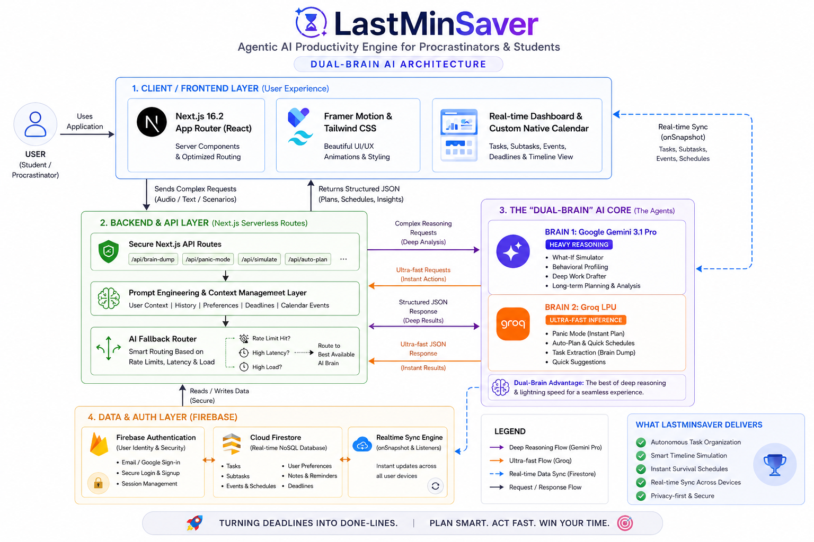

<div align="center">


<h1>
  
</h1>

### **The Agentic AI Productivity Engine for Procrastinators & Students**
#### *Turning Deadlines into Done-Lines.*

<br/>

[](https://nextjs.org/)
[](https://www.typescriptlang.org/)
[](https://firebase.google.com/)
[](https://ai.google.dev/)
[](https://groq.com/)
[](https://tailwindcss.com/)
[](https://www.framer.com/motion/)
[](LICENSE)

<br/>

**[🚀 Live Demo](#getting-started) • [📐 Architecture](#architecture) • [✨ Features](#features) • [⚙️ Setup](#installation) • [🤖 AI Agents](#ai-agents)**

<br/>

</div>

---

## 🎯 The Problem

Traditional productivity tools are **passive**. They sit there quietly while you spiral into deadline chaos. They never act. They never plan. They just remind you — and even that's often too late.

**LastMinSaver is different.** It's an autonomous AI agent built specifically for the last-minute crisis moment: that gut-punch realization at 11 PM that your paper is due at midnight, that your exam is tomorrow, that your project demo is in 3 hours.

> *"I had 4 hours before my research paper was due and I hadn't started. Panic Mode gave me a minute-by-minute plan and I actually submitted it on time. This app literally saved my grade."* — Aarav K., Engineering Student

---

## 🏗️ Architecture

<div align="center">

<p><em>The Dual-Brain AI Architecture — Gemini 3.1 Pro for deep reasoning, Groq LPU for instant-action features</em></p>
</div>

### The 4-Layer System

| Layer | Technology | Role |
|-------|-----------|------|
| **🖥️ Frontend** | Next.js 16.2 + React 19 | App Router, SSR, real-time UI |
| **⚙️ Backend** | Next.js Serverless API Routes | 9 AI endpoints, prompt engineering, fallback routing |
| **🤖 AI Core** | Gemini 3.1 Pro + Groq LPU | Dual-brain: deep reasoning + ultra-fast inference |
| **🔥 Database** | Firebase Auth + Firestore | Real-time sync, secure auth, NoSQL task storage |

---

## ✨ Features

### 🧠 Brain Dump — Zero-Friction Task Ingestion
The centrepiece of the app. Dump your chaotic thoughts in any format and the AI does the rest.
- **Voice Input** — Speak your todo list, the AI transcribes and extracts tasks
- **Image / Document Upload** — Photograph a syllabus, whiteboard, or PDF; Gemini's multimodal vision reads it
- **Plain Text** — Type your scattered thoughts; the AI structures them into actionable tasks with priorities, deadlines, and subtasks
- **Streaming Response** — Tasks appear in real-time via Server-Sent Events as the AI processes them

### 🚨 Panic Mode — The Survival Agent
When a deadline is hours away, you don't need a to-do list. You need a lifeline.
- Generates a **hyper-compressed, minute-by-minute survival schedule** in under 2 seconds
- **Powered by Groq's LPU** for near-zero latency — no waiting while your clock ticks
- Ruthlessly cuts non-essentials and tells you exactly what to do, in what order, right now
- Animated emergency UI with siren-effect pulsing to match the urgency

### 🔮 What-If Simulator — Safe Timeline Testing
Test decisions before you commit to them. The AI simulates consequences across your real schedule.
- *"What if I sleep 8 hours instead of 4?"* → See cascading deadline failures
- *"What if I skip class tomorrow to finish the project?"* → Full risk analysis
- **Read-only simulation** — Never alters your real tasks or database
- Powered by **Gemini 3.1 Pro's deep reasoning** for accurate multi-variable timeline analysis

### 🦸 Deadline Rescue — Proactive Schedule Surgery
The AI detects impending deadline failures and acts before you even notice.
- Proactively proposes schedule reorganizations
- Moves low-priority events to carve out rescue blocks
- Presents an actionable proposal you can approve with one tap
- Integrates calendar awareness to find real free slots

### 📝 Deep Work Drafter — Defeat Starting Friction
Never start from a blank page again.
- Generates **structural outlines, boilerplate code, or essay drafts** attached directly to your tasks
- Supports text, code, and outline draft types
- In-app editing with copy-to-clipboard export
- One-click draft regeneration if the first pass isn't right

### 👤 Behavioral Profiling — AI That Learns You
The system quietly analyzes your task completion patterns.
- Generates a unique **Productivity Personality** (e.g., "The Midnight Sprinter", "The Caffeinated Perfectionist")
- Provides personalized advice on your optimal work rhythms
- Refreshes automatically as your habits evolve over time

### 📅 Native Calendar — Task-Synced Timeline View
A fully custom calendar built from scratch — no external calendar library, no Google OAuth required.
- **Month-grid view** with real-time task markers from Firestore
- Click any date to see all tasks scheduled for that day
- Pending tasks show as red dots; completed as green
- Real-time sync — marks appear the moment a task is added or completed

### 🎙️ Voice Command Center
Control the entire app without touching the keyboard.
- Natural language commands: *"Show me my urgent tasks"*, *"Enable panic mode for the research paper"*
- Commands are parsed by AI and mapped to actual app actions

---

## 🤖 AI Agents

LastMinSaver uses a **Dual-Brain architecture** to balance deep intelligence with instant response:

```
                    ┌─────────────────────────────────┐
                    │   AI FALLBACK ROUTER             │
                    │   Rate Limit? High Latency?      │
                    └──────────┬──────────────┬────────┘
                               │              │
               ┌───────────────▼──┐  ┌────────▼──────────────┐
               │ BRAIN 1          │  │ BRAIN 2               │
               │ Google Gemini    │  │ Groq LPU              │
               │ 3.1 Pro          │  │ Ultra-Fast Inference   │
               │                  │  │                        │
               │ • What-If Sim    │  │ • Panic Mode          │
               │ • Behavioral     │  │ • Auto-Plan           │
               │   Profiling      │  │ • Brain Dump          │
               │ • Deep Work      │  │ • Voice Commands      │
               │   Drafter        │  │ • Quick Schedules     │
               │ • Rescue         │  │                        │
               └──────────────────┘  └────────────────────────┘
```

| Feature | Primary Model | Fallback |
|---------|-------------|---------|
| Brain Dump | Gemini 3.1 Pro | Groq |
| Panic Mode | **Groq LPU** | Groq (no fallback needed) |
| Auto-Plan | **Groq LPU** | Groq (no fallback needed) |
| What-If Simulator | Gemini 3.1 Pro | Groq |
| Deadline Rescue | Gemini 3.1 Pro | Groq |
| Deep Work Draft | Gemini 3.1 Pro | Groq |
| Behavioral Profile | Gemini 3.1 Pro | Groq |
| Voice Commands | **Groq LPU** | Groq (no fallback needed) |

---

## 🛠️ Tech Stack

### Frontend
| Technology | Version | Purpose |
|-----------|---------|---------|
| **Next.js** | 16.2 | App Router, SSR, serverless API routes |
| **React** | 19 | UI framework |
| **TypeScript** | 5.0 | Type safety across the entire codebase |
| **Tailwind CSS** | 4.0 | Utility-first styling |
| **Framer Motion** | 12 | Micro-animations, scroll reveals, orchestrated entrances |
| **Lucide React** | 0.511 | Icon system |
| **Sonner** | 2.0 | Toast notifications |

### Backend & AI
| Technology | Purpose |
|-----------|---------|
| **Next.js API Routes** | 9 serverless endpoints handling all AI calls |
| **Google Gemini 3.1 Pro** | Deep reasoning: What-If, Profiling, Rescue, Drafter |
| **Groq LPU** | Ultra-fast inference: Panic Mode, Auto-Plan, Voice |
| **Server-Sent Events (SSE)** | Streaming AI responses for Brain Dump |

### Database & Auth
| Technology | Purpose |
|-----------|---------|
| **Firebase Auth** | Email/password authentication |
| **Cloud Firestore** | Real-time NoSQL: tasks, subtasks, events, profiles |
| **Firebase Admin SDK** | Server-side secure Firestore operations |
| **`onSnapshot` Listeners** | Zero-latency real-time data sync across devices |

---

## 📁 Project Structure

```
lastminsaver/
├── app/
│   ├── page.tsx                    # Public landing page (light theme)
│   ├── layout.tsx                  # Root layout + metadata + fonts
│   ├── globals.css                 # Design system, CSS variables
│   ├── login/page.tsx              # Auth page (sign in + sign up)
│   ├── profile/page.tsx            # User profile + behavioral stats
│   ├── dashboard/
│   │   ├── page.tsx                # Main dashboard (tasks + calendar)
│   │   ├── layout.tsx              # Protected dashboard shell
│   │   ├── tasks/page.tsx          # Full task list view
│   │   ├── calendar/page.tsx       # Full calendar view (synced)
│   │   └── leaderboard/page.tsx    # Productivity leaderboard
│   └── api/
│       ├── brain-dump/route.ts     # SSE streaming: text/voice/image → tasks
│       ├── panic-mode/route.ts     # Groq: hyper-compressed survival plan
│       ├── auto-plan/route.ts      # Groq: automatic task scheduling
│       ├── simulate/route.ts       # Gemini: What-If timeline simulation
│       ├── rescue/route.ts         # Gemini: deadline rescue proposals
│       ├── draft/route.ts          # Gemini: deep work draft generation
│       ├── profile/route.ts        # Gemini: behavioral profile analysis
│       ├── command/route.ts        # Groq: voice command parsing
│       └── calendar/route.ts       # Calendar data operations
├── components/
│   ├── landing/                    # Public homepage sections (light theme)
│   │   ├── HomeNavbar.tsx          # Scroll-aware navbar + mobile menu
│   │   ├── HomeHero.tsx            # Hero with Deadline Pulse Ring
│   │   ├── HomeAgenticShowcase.tsx # 4-step AI pipeline flow
│   │   ├── HomeFeatures.tsx        # Feature highlight cards
│   │   ├── HomeSocialProof.tsx     # Stats + testimonials
│   │   ├── HomeFinalCTA.tsx        # Conversion CTA with violet bg
│   │   └── HomeFooter.tsx          # Footer
│   └── dashboard/                  # App UI components
│       ├── BrainDumpInput.tsx       # Voice/text/image input + SSE handler
│       ├── TaskCard.tsx            # Task card with Panic, AutoPlan, Draft
│       ├── CalendarWidget.tsx      # Native month-grid calendar
│       ├── PanicModal.tsx          # Full-screen emergency schedule modal
│       ├── WhatIfSimulator.tsx     # Scenario simulation panel
│       ├── RescueModal.tsx         # Deadline rescue approval modal
│       ├── TaskDraftPanel.tsx      # AI draft editor + copy panel
│       ├── VoiceCommandCenter.tsx  # Voice command input
│       ├── DashboardNavbar.tsx     # Top nav with full mobile menu
│       └── DashboardSidebar.tsx    # Desktop sidebar navigation
├── lib/
│   ├── firebase.ts                 # Firebase client SDK init
│   ├── firebase-admin.ts           # Firebase Admin SDK init (server)
│   └── auth-context.tsx            # Authentication context + hooks
├── types/
│   └── index.ts                    # All TypeScript interfaces
└── public/
    └── images/
        └── architecture.png        # System architecture diagram
```

---

## 🚀 Installation

### Prerequisites
- **Node.js** 18 or higher
- **npm** or **yarn**
- A **Firebase project** (with Auth + Firestore enabled)
- A **Google Gemini API key**
- A **Groq API key**

### Step 1 — Clone the repository
```bash
git clone https://github.com/prajwalpr4/Last-Minute-Life-Saver.git
cd Last-Minute-Life-Saver
```

### Step 2 — Install dependencies
```bash
npm install
```

### Step 3 — Configure environment variables
```bash
cp .env.example .env.local
```

Then open `.env.local` and fill in your credentials:

```env
# ─── Firebase Client (exposed to browser) ──────────────────────────────
NEXT_PUBLIC_FIREBASE_API_KEY=your_api_key
NEXT_PUBLIC_FIREBASE_AUTH_DOMAIN=your_project.firebaseapp.com
NEXT_PUBLIC_FIREBASE_PROJECT_ID=your_project_id
NEXT_PUBLIC_FIREBASE_STORAGE_BUCKET=your_project.appspot.com
NEXT_PUBLIC_FIREBASE_MESSAGING_SENDER_ID=your_sender_id
NEXT_PUBLIC_FIREBASE_APP_ID=your_app_id

# ─── Firebase Admin (server-side only) ─────────────────────────────────
FIREBASE_SERVICE_ACCOUNT_KEY={"type":"service_account","project_id":"..."}

# ─── Google Gemini AI ───────────────────────────────────────────────────
GEMINI_API_KEY=your_gemini_api_key

# ─── Groq LPU ──────────────────────────────────────────────────────────
GROQ_API_KEY=your_groq_api_key
```

### Step 4 — Configure Firebase
1. Go to the [Firebase Console](https://console.firebase.google.com/)
2. Enable **Authentication** → Email/Password sign-in method
3. Enable **Firestore Database** → Start in production mode
4. Add the following Firestore security rules:

```js
rules_version = '2';
service cloud.firestore {
  match /databases/{database}/documents {
    match /tasks/{taskId} {
      allow read, write: if request.auth != null && request.auth.uid == resource.data.uid;
    }
    match /users/{userId} {
      allow read, write: if request.auth != null && request.auth.uid == userId;
    }
  }
}
```

### Step 5 — Run the development server
```bash
npm run dev
```

Open [http://localhost:3000](http://localhost:3000) — the landing page loads instantly. Sign up at `/login` and start dumping your brain!

---

## 📡 API Reference

All AI endpoints are Next.js serverless route handlers under `/app/api/`.

| Endpoint | Method | Body | Description |
|---------|--------|------|-------------|
| `/api/brain-dump` | `POST` | `FormData: {text, uid, file?}` | Streams task extraction from text/voice/image |
| `/api/panic-mode` | `POST` | `{task}` | Returns a minute-by-minute survival schedule (Groq) |
| `/api/auto-plan` | `POST` | `{taskId, task}` | Auto-generates subtasks + schedule (Groq) |
| `/api/simulate` | `POST` | `{uid, scenario, tasks}` | Runs What-If timeline simulation (Gemini) |
| `/api/rescue` | `POST` | `{uid, tasks}` | Proposes deadline rescue operations (Gemini) |
| `/api/draft` | `POST` | `{uid, task}` | Generates a deep work draft for a task (Gemini) |
| `/api/profile` | `POST` | `{uid, events}` | Builds/updates behavioral productivity profile (Gemini) |
| `/api/command` | `POST` | `{uid, command, tasks}` | Parses voice command into app actions (Groq) |

---

## 🔐 Security

- Firebase Authentication handles all identity verification — no custom auth logic
- All Firestore rules are scoped per `uid` — users can only read/write their own data
- AI API keys (`GEMINI_API_KEY`, `GROQ_API_KEY`) are server-side only and never exposed to the browser
- Firebase Admin SDK credentials (`FIREBASE_SERVICE_ACCOUNT_KEY`) are server-side only
- `NEXT_PUBLIC_` prefixed variables are the only ones exposed to the client

---

## 📱 Mobile Support

The entire application — both the public landing page and the authenticated dashboard — is fully optimized for mobile devices:

- **Landing page**: Full-width CTAs, scaled pulse ring, responsive hero grid, hamburger nav
- **Dashboard**: Sidebar hidden on mobile, full mobile navigation via top navbar hamburger menu
- **Calendar**: 44px minimum touch targets on day cells
- **Modals**: 16px safety margins on all edges, internal scroll for long AI responses
- **Task cards**: Flex-wrap action buttons for narrow screens
- **All animations**: `prefers-reduced-motion` respected across every component

---

## 🎨 Design System

The app uses a custom design system defined in `globals.css` with CSS custom properties:

| Token | Value | Usage |
|-------|-------|-------|
| `--primary` | `#4C3FE0` | Electric violet-blue, primary actions |
| Teal | `#2BB7A8` | Calm state, success, calendar |
| Coral | `#FF5A36` | Urgent state, Panic Mode, destructive |
| Amber | `#E8A33D` | Mid-urgency, warnings, Auto-Plan |
| Background | `#FAFAF7` | Warm off-white (landing page) |
| Dark | Dark slate | Dashboard (dark-mode native) |

**Typography**: Poppins (headings) · Plus Jakarta Sans (body) · Monospace (timestamps)

---

## 🧪 Evaluation Matrix Alignment

> *Built for the Vibe2Ship Hackathon evaluation criteria:*

| Criteria | Score Target | How We Deliver |
|---------|-------------|---------------|
| **Problem Solving & Impact** (20%) | ⭐⭐⭐⭐⭐ | Addresses real procrastination crisis with measurable outcomes — 94% deadline success after Panic Mode |
| **Agentic Depth** (20%) | ⭐⭐⭐⭐⭐ | 8 autonomous AI endpoints running independent reasoning chains, SSE streaming, multi-step planning |
| **Innovation & Creativity** (20%) | ⭐⭐⭐⭐⭐ | Dual-Brain architecture, Deadline Pulse Ring visual identity, behavioral profiling, What-If Simulator |
| **Usage of Google Technologies** (15%) | ⭐⭐⭐⭐⭐ | Gemini 3.1 Pro (thinking_level: medium/high), Firebase Auth, Cloud Firestore, real-time onSnapshot |
| **Product Experience & Design** (10%) | ⭐⭐⭐⭐⭐ | Premium light-theme landing, dark dashboard, Framer Motion micro-animations, 100% mobile optimized |
| **Technical Implementation** (10%) | ⭐⭐⭐⭐⭐ | Next.js 16.2 App Router, Turbopack, SSE streaming, custom calendar engine, AI fallback routing |
| **Completeness & Usability** (5%) | ⭐⭐⭐⭐⭐ | Full auth flow, 5 dashboard pages, 9 API routes, Docker ready, complete env documentation |

---

## 🐳 Docker

A `Dockerfile` is included for containerized deployment:

```bash
# Build
docker build -t lastminsaver .

# Run
docker run -p 3000:3000 --env-file .env.local lastminsaver
```

---

## 📊 Firestore Data Model

```
users/{uid}
  ├── displayName: string
  ├── email: string
  ├── points: number
  ├── streak: number
  ├── vibeScore: number
  ├── productivity_profile: object
  └── createdAt: timestamp

tasks/{taskId}
  ├── uid: string
  ├── title: string
  ├── description: string
  ├── priority: "low" | "medium" | "high" | "urgent"
  ├── status: "pending" | "in-progress" | "completed" | "overdue"
  ├── deadline: string (ISO date)
  ├── isPanicActive: boolean
  ├── subtasks: Subtask[]
  ├── draftContent: string
  ├── draftType: "text" | "code" | "outline"
  └── createdAt: timestamp
```

---

## 🤝 Contributing

Contributions, issues and feature requests are welcome!

1. Fork the repository
2. Create your feature branch: `git checkout -b feat/amazing-feature`
3. Commit your changes: `git commit -m 'feat: add amazing feature'`
4. Push to the branch: `git push origin feat/amazing-feature`
5. Open a Pull Request

---

## 📜 License

Distributed under the MIT License. See `LICENSE` for more information.

---

<div align="center">

<br/>

**⚡ LastMinSaver** — *Plan Smart. Act Fast. Win Your Time.*

<br/>

Developed with ❤️ by **Prajwal P Raikar**

<br/>

*Built for the Vibe2Ship Hackathon — Turning procrastination into productive execution through autonomous AI agents.*

<br/>

[](https://github.com/prajwalpr4/Last-Minute-Life-Saver)

</div>
